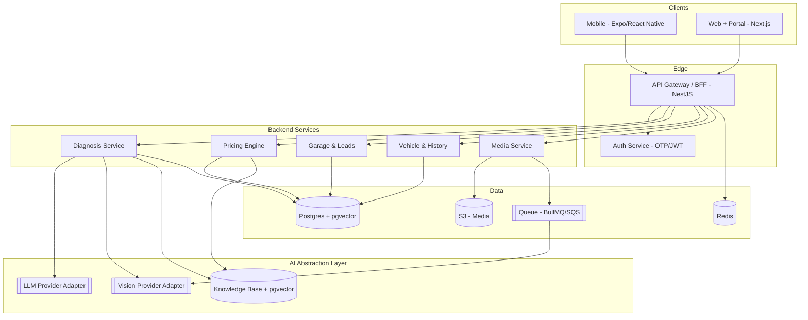
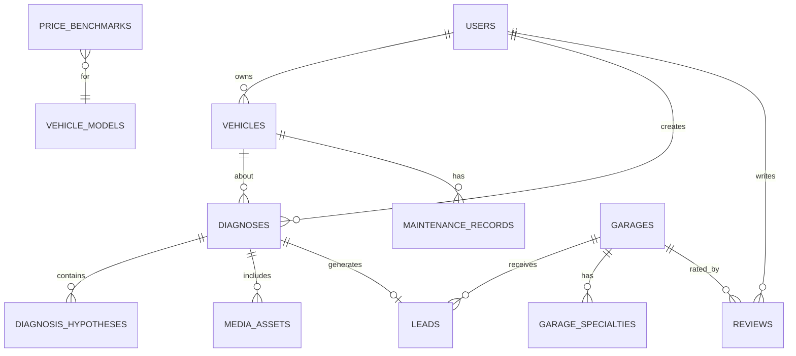

# Architecture · DB Schema · API — CarGPT (v1.0)

**Stack: Expo/React Native + Next.js · NestJS · Postgres+pgvector · S3 · BullMQ/Redis · Provider-agnostic AI**

---

## שלב 7 — ארכיטקטורה

### עקרונות
Clean Architecture · Feature-based · SOLID · Provider-agnostic AI · Event-driven למדיה. כל רכיב ניתן להחלפה מאחורי interface.

### תרשים על


### שכבות (per feature)
`api (controller) → application (use-cases) → domain (entities/rules) → infrastructure (db/ai/storage)`. ה-domain לא יודע על Postgres או OpenAI.

### AI Abstraction Layer
```ts
interface LLMProvider {
  complete(req: PromptRequest): AsyncIterable<Token>;
  embed(text: string): Promise<number[]>;
}
interface VisionProvider {
  analyze(image: MediaRef, task: VisionTask): Promise<VisionResult>;
}
// Adapters: OpenAIProvider, AnthropicProvider, GeminiProvider
// Router בוחר ספק לפי task/עלות/זמינות; fallback אוטומטי.
```
- **Diagnosis pipeline:** normalize → RAG retrieve → prompt מובנה → LLM reasoning → structured output (הסתברויות+confidence+דחיפות) → safety guardrails → תגובה.
- **Media:** upload → S3 (signed URL) → job בתור → Vision adapter → תוצאה מקושרת (אסינכרוני).

### החלטות ארכיטקטוניות
| החלטה | נבחר | חלופה שנדחתה | נימוק |
|---|---|---|---|
| מבנה שירותים | Modular Monolith (NestJS) | Microservices מלא | מהירות ל-V1; מוכן לפיצול |
| API | REST + SSE לצ'אט | GraphQL | פשטות, caching, BFF |
| DB | Postgres + pgvector | DB וקטורי נפרד | פחות רכיבים, transactional+vector |
| עיבוד מדיה | תור אסינכרוני | סינכרוני inline | לא לחסום בקשות; scale נפרד |

---

## שלב 8 — סכמת DB



### טבלאות ליבה (V1)
```
users(id, phone, email, role[driver|garage|admin], name, region, created_at)
vehicles(id, user_id, make, model, year, engine, plate_hash, mileage, created_at)
vehicle_models(id, make, model, year_range, engine)
diagnoses(id, user_id, vehicle_id, input_type[text|image], raw_input,
          status, urgency[green|yellow|red], summary, model_provider, created_at)
diagnosis_hypotheses(id, diagnosis_id, label, probability, confidence,
          reasoning, est_price_low, est_price_avg, est_price_high,
          est_labor_hours, risk_level)
media_assets(id, diagnosis_id, type[image|audio|video], s3_key,
          status[pending|processed|failed], vision_result_json)
price_benchmarks(id, vehicle_model_id, repair_type, region,
          price_low, price_avg, price_high, sample_size, source, updated_at)
garages(id, name, region, geo_lat, geo_lng, rating_avg, rating_count,
          phone, verified, created_at)
garage_specialties(id, garage_id, specialty)
leads(id, diagnosis_id, garage_id, status[new|accepted|contacted|won|lost],
          price_quote, created_at, updated_at)
reviews(id, garage_id, user_id, rating, text, verified_visit, created_at)
maintenance_records(id, vehicle_id, type, cost, mileage, doc_s3_key,
          source[manual|ocr], performed_at)
kb_documents(id, title, source, embedding vector, chunk_text)
audit_logs(id, actor_id, action, entity, entity_id, meta_json, created_at)
```
- **אינדקסים:** `diagnoses(vehicle_id, created_at)`, `leads(garage_id, status)`, `price_benchmarks(vehicle_model_id, repair_type, region)`, geo index על `garages`, `ivfflat` על `kb_documents.embedding`.
- **פרטיות:** `plate_hash`, retention למדיה, דאטה מצרפית אנונימית לתמחור.

---

## שלב 9 — API (REST + SSE)

### Auth
```
POST /auth/otp/request        { phone }
POST /auth/otp/verify         { phone, code } -> { accessToken, refreshToken }
POST /auth/refresh
```

### Vehicles
```
GET    /vehicles
POST   /vehicles              { make, model, year, engine, mileage }
PATCH  /vehicles/:id
GET    /vehicles/:id/history
```

### Diagnosis (ליבה)
```
POST   /diagnoses                     { vehicleId, inputType, text? }
        -> { diagnosisId, followUpQuestions[] }
POST   /diagnoses/:id/answers         { answers[] }
GET    /diagnoses/:id/stream          (SSE: reasoning + partial result)
GET    /diagnoses/:id                 -> { urgency, hypotheses[], price, disclaimer }
POST   /diagnoses/:id/media           (multipart / signed-url)
GET    /diagnoses/:id/media/:mid      -> { status, visionResult }
```

### Pricing
```
GET    /pricing/estimate?vehicleModelId=&repairType=&region=
        -> { low, avg, high, laborHours, sampleSize }
```

### Garages & Leads
```
GET    /garages?specialty=&region=&near=lat,lng&sort=distance|rating|price
GET    /garages/:id
POST   /diagnoses/:id/send-to-garage  { garageId }  -> creates lead
```

### Portal (מוסך)
```
GET    /portal/leads?status=
PATCH  /portal/leads/:id               { status, priceQuote }
GET    /portal/analytics
PATCH  /portal/garage                  { profile, specialties[] }
```

### עקרונות רוחביים
JWT + RBAC · rate limiting per-user/route · ולידציה בגבול (DTO) · pagination (cursor) · versioning `/v1` · שגיאות אחידות `{ code, message, traceId }` · audit_logs לכל פעולה רגישה · SSE לצ'אט.
