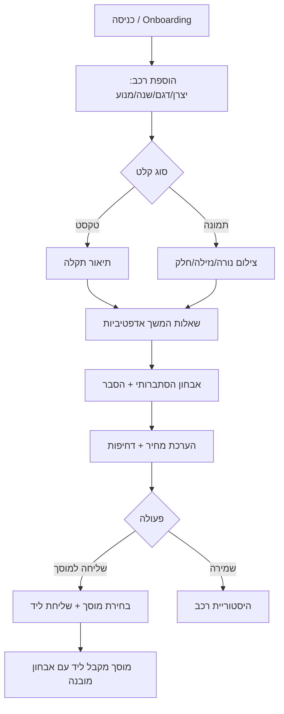

# PRD — CarGPT (v1.0)

**מסמך דרישות מוצר · שוק: ישראל · מודל: B2B2C · פלטפורמה: Web + Mobile**

---

## 1. תקציר מנהלים
CarGPT היא פלטפורמת AI שמסירה את אי-הוודאות והחשש מכל החלטת תחזוקת רכב. הצרכן מקבל אבחון הסתברותי + הערכת מחיר בלתי-תלויה + חיבור למוסך המתאים — בחינם. המנוע העסקי הוא לידים מוכשרים ו-SaaS למוסכים, הנבנים על מנוע מחיר-ואמון מבוסס דאטה אמיתית לפי דגם×אזור×מוסך בישראל.

**מטרת V1:** לבנות את מנוע איסוף הדאטה (data flywheel) עם חוויית צרכן מעולה, ולהוכיח את לולאת ה-Diagnosis→Garage.

## 2. הבעיה
- **צרכן:** אי-ודאות מול המוסך ("האם באמת צריך? כמה זה אמור לעלות? מסוכן לנסוע?"), חשש מ-overcharge, קושי לבחור מוסך אמין.
- **מוסך:** רעב ללידים איכותיים; מקבל לקוחות שלא יודעים לתאר את התקלה; זמן מבוזבז על אבחון ראשוני.

## 3. Personas
1. **"דנה הנהגת המודאגת"** (עיקרי) — 28–55, לא טכנית, נדלקה נורה/רעש, רוצה לדעת אם מסוכן וכמה יעלה לפני שנוסעת למוסך.
2. **"יוסי ה-DIY"** (משני) — אוהב לתחזק בעצמו, רוצה אבחון מדויק וקודי OBD.
3. **"מוסך רן" (בעל מוסך)** (B2B) — רוצה לידים חמים, לקוחות עם אבחון מובנה, וכלי ניהול.
4. **"רוכש יד-2"** (עתידי) — רוצה דוח היסטוריה/בדיקה לפני קנייה.

## 4. User Stories (V1)
- כנהג, אני רוצה לתאר תקלה בטקסט ולקבל אבחון הסתברותי עם הסבר.
- כנהג, אני רוצה לצלם נורת דשבורד ולהבין משמעות ודחיפות.
- כנהג, אני רוצה הערכת מחיר (נמוך/ממוצע/גבוה) לתיקון המשוער באזור שלי.
- כנהג, אני רוצה לדעת אם מסוכן להמשיך לנסוע (🟢🟡🔴).
- כנהג, אני רוצה לשלוח את האבחון למוסך מומלץ בקליק.
- כנהג, אני רוצה לשמור היסטוריית רכב (תקלות, טיפולים, קבלות).
- כבעל מוסך, אני רוצה לקבל ליד עם אבחון מובנה ולנהל אותו.

## 5. פיצ'רים — היקף לפי גרסה

| # | פיצ'ר | V1 (MVP) | V1.5 | V2+ |
|---|---|:--:|:--:|:--:|
| 1 | Chat אבחון טקסטואלי + reasoning | ✅ | | |
| 2 | שאלות המשך אדפטיביות | ✅ | | |
| 3 | אבחון הסתברותי + הסבר | ✅ | | |
| 4 | הערכת מחיר (דגם×אזור) | ✅ | | |
| 5 | רמת דחיפות 🟢🟡🔴 + guardrails | ✅ | | |
| 6 | צילום נורת דשבורד (Vision) | ✅ | | |
| 7 | צילום תמונה כללית (נזילה/צמיג/בלם) | ✅ | | |
| 8 | חיפוש והמלצת מוסכים | ✅ | | |
| 9 | שליחת אבחון למוסך (lead) | ✅ | | |
| 10 | היסטוריית רכב + תזכורות | ✅ | | |
| 11 | OCR חשבונית→היסטוריה | | ✅ | |
| 12 | פורטל SaaS למוסך (ניהול לידים) | | ✅ | |
| 13 | אודיו (זיהוי רעשים) | | ✅ | |
| 14 | וידאו (רעידות/עשן) | | | ✅ |
| 15 | OBD Bluetooth | | | ✅ |
| 16 | קהילה (Reddit-style) | | | ✅ |
| 17 | Marketplace חלפים / ביטוח | | | ✅ |

**Out of scope ל-V1:** אודיו/וידאו/OBD/קהילה/marketplace — נדחים בכוונה כדי למקד את ה-MVP במנוע הדאטה והלידים.

## 6. Flow עיקרי

## 7. דרישות פונקציונליות מרכזיות
- **מנוע אבחון:** מחזיר תמיד התפלגות הסתברויות (לא תשובה מוחלטת) + הסבר לכל אפשרות + confidence.
- **מנוע מחיר:** V1 מבוסס טבלת benchmark ראשונית (סקר מוסכים + מקורות ציבוריים בישראל) → משתדרג לדאטה אמיתית מ-OCR/לידים.
- **Safety guardrails:** בכל תרחיש בטיחותי (בלמים/היגוי/צמיגים/חום מנוע) — ברירת מחדל 🔴/🟡 עם disclaimer, לעולם לא 🟢 בביטחון גבוה בלי ודאות.
- **Provider-agnostic AI:** שכבת הפשטה מאחורי interface אחיד (LLM + Vision), החלפת ספק ללא שינוי לוגיקה.

## 8. דרישות לא-פונקציונליות
- **ביצועים:** תשובת אבחון ראשונית < 3 שניות (streaming), עיבוד תמונה < 6 שניות.
- **אבטחה:** Auth (email/OTP), authorization מבוסס תפקידים (נהג/מוסך/אדמין), הצפנה at-rest ו-in-transit, rate limiting, audit logs, מדיה ב-S3 עם signed URLs.
- **פרטיות:** אנונימיזציה של דאטה מצרפית; עמידה בדרישות הגנת הפרטיות הישראלית; מחיקת מדיה לפי מדיניות retention.
- **נגישות:** WCAG AA, RTL מלא (עברית), Dark/Light.
- **זמינות:** עיבוד מדיה כבד ברקע (תור), עם עדכון סטטוס אסינכרוני.

## 9. מדדי הצלחה (V1)
- **North Star:** אבחונים שהסתיימו בפעולה מאומתת (שליחת ליד / שמירה+חזרה).
- **KPIs:** Diagnosis→Garage conversion ≥ 15%, retention D30 ≥ 20%, דיוק מחיר (סטייה מהחשבונית בפועל) ≤ ±20%, זמן-לתובנה < 60 שניות, ≥ 30 מוסכים פעילים בפיילוט.

## 10. סיכונים והפחתה

| סיכון | הפחתה |
|---|---|
| Liability מאבחון שגוי | disclaimers, guardrails בטיחות, ניסוח הסתברותי, "לא תחליף לבדיקת מכונאי" |
| דיוק AI נמוך | RAG על מקורות אמינים, feedback loop, human-in-the-loop לפיילוט |
| Cold-start דאטת מחיר | benchmark ראשוני ידני + תמריץ ל-OCR חשבוניות |
| גיוס מוסכים איטי | פיילוט מקומי (אזור אחד), הצעת לידים חינם בהתחלה |
| "GPT wrapper" | מיקוד ב-data moat + מנוע מחיר ישראלי ייחודי |

## 11. הנחות פתוחות לאימות
- כמה מוסכים מוכנים לשלם per-lead בישראל ובאיזה מחיר?
- שיעור המשתמשים שיעלו תמונה מול טקסט בלבד?
- דיוק מנוע המחיר הראשוני מול חשבוניות אמת?
