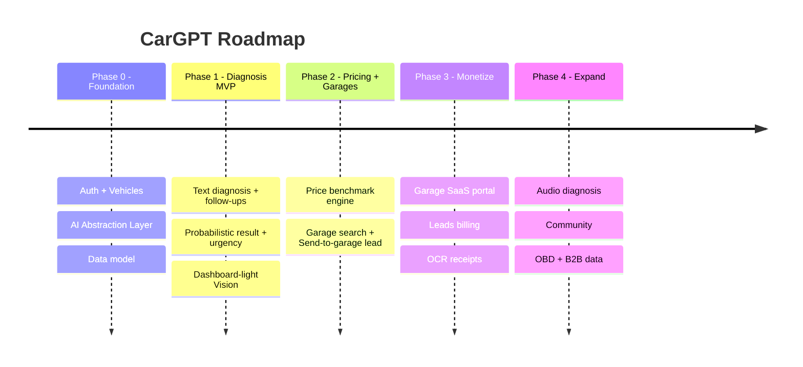

# Roadmap · Backlog · Tasks — CarGPT (v1.0)

---

## שלב 11 — Roadmap

| Phase | מטרה | Deliverables | קריטריון יציאה |
|---|---|---|---|
| **0 — Foundation** | תשתית | Auth OTP, Vehicles CRUD, AI layer + provider אחד, DB, CI/CD | משתמש נרשם, מוסיף רכב |
| **1 — Diagnosis MVP** | ליבת ערך | אבחון טקסט + שאלות המשך + תוצאה הסתברותית + דחיפות + Vision לנורות | אבחון end-to-end < 60ש' |
| **2 — Pricing + Garages** | לולאת ליד | מנוע מחיר, חיפוש מוסכים, שליחת אבחון | ליד ראשון נשלח |
| **3 — Monetize** | הכנסה | פורטל SaaS, ניהול לידים, OCR | מוסך משלם על ליד |
| **4 — Expand** | Moat | אודיו, קהילה, OBD, דאטה B2B | data flywheel פעיל |

---

## שלב 12 — Backlog (Epics → Stories)

**EPIC A — Foundation & Auth:** A1 OTP login+JWT · A2 RBAC · A3 Vehicles CRUD + סריקת רישיון · A4 CI/CD.

**EPIC B — AI Diagnosis Engine:** B1 AI Abstraction Layer · B2 Structured output · B3 שאלות המשך · B4 Safety guardrails · B5 RAG · B6 Vision נורות · B7 Vision תמונה כללית · B8 SSE streaming.

**EPIC C — Pricing Engine:** C1 price_benchmarks+seed · C2 endpoint הערכה · C3 חיבור לאבחון.

**EPIC D — Garages & Leads:** D1 Garages+geo · D2 מיון · D3 Send-to-garage · D4 Reviews+trust.

**EPIC E — Vehicle History:** E1 records+תזכורות · E2 OCR חשבונית.

**EPIC F — Garage SaaS Portal:** F1 לידים · F2 תמחור · F3 אנליטיקס+billing.

**EPIC G — Cross-cutting:** G1 Design System · G2 RTL/Dark/נגישות · G3 Security · G4 Observability.

---

## שלב 13 — משימות (Sprint 1 — Foundation)

| # | משימה | Epic | תלות | הערכה |
|---|---|---|---|---|
| S1-1 | Scaffold monorepo (apps: mobile, web, api; packages: shared, ui) | G | — | M |
| S1-2 | Postgres+pgvector + migrations בסיס | A | S1-1 | S |
| S1-3 | Auth OTP + JWT/refresh | A1 | S1-2 | M |
| S1-4 | RBAC middleware | A2 | S1-3 | S |
| S1-5 | Vehicles CRUD (API) | A3 | S1-2 | S |
| S1-6 | AI Abstraction Layer + adapter ראשון | B1 | S1-1 | M |
| S1-7 | Design System tokens + קומפוננטות בסיס | G1/G2 | S1-1 | M |
| S1-8 | מסך Onboarding + הוספת רכב | A3 | S1-5,S1-7 | M |
| S1-9 | Security base: rate limit + audit_logs + signed URLs | G3 | S1-3 | S |
| S1-10 | CI/CD + staging | A4 | S1-1 | M |

**DoD:** בדיקות יחידה ל-core · ולידציה בגבול · RTL+נגישות · אין secrets · לוגים+טיפול שגיאות אחיד · code review + CI ירוק.
