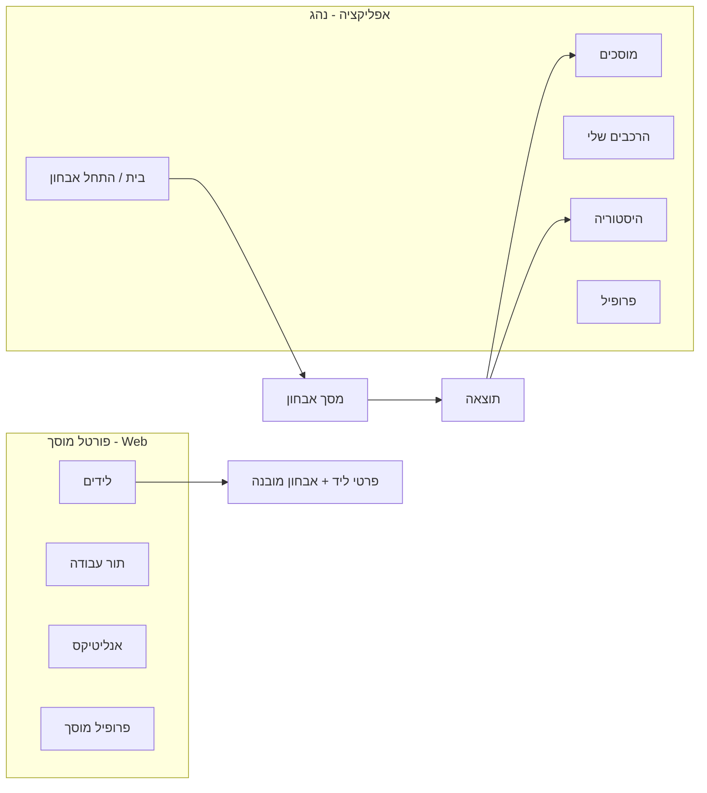

# UX & Design System — CarGPT (v1.0)

**שוק: ישראל · Mobile-first · RTL · Dark/Light**

---

## שלב 4 — אפיון UX

### עקרונות מנחים
1. **Zero-anxiety** — כל מסך מרגיע, לא מפחיד. שפה אנושית, לא ז'רגון.
2. **Time-to-insight < 60 שניות** — פחות שדות, יותר AI.
3. **Mobile-first, RTL-native** — עברית ימין→שמאל, thumb-zone.
4. **Progressive disclosure** — קודם תשובה קצרה, אז פירוט בלחיצה.
5. **Trust by transparency** — תמיד confidence + מקור + "הערכה, לא אבחון סופי".

### Information Architecture


### Flows (V1)
- **Onboarding:** ברוכים הבאים → הוספת רכב (יצרן/דגם/שנה/מנוע או סריקת רישיון) → בית.
- **Diagnosis:** בחירת קלט (טקסט/תמונה) → תיאור → שאלות המשך (chips) → אבחון הסתברותי → מחיר+דחיפות → CTA.
- **Garage handoff:** רשימת מוסכים ממוינת → כרטיס מוסך → "שלח אבחון" → אישור.
- **Portal (מוסך):** רשימת לידים → כרטיס ליד עם אבחון מובנה → עדכון סטטוס.

---

## שלב 5 — Wireframes (Low-Fi)

### מסך בית (Mobile)
```
┌───────────────────────────┐
│ ☰            CarGPT     👤 │
│  שלום דנה 👋              │
│  מה קורה עם הרכב?         │
│ ┌───────────────────────┐ │
│ │  🎤  תאר/י תקלה...     │ │
│ └───────────────────────┘ │
│ [📷 צלם נורה] [📸 צלם חלק]│
│  הרכב שלי:  מאזדה 3 '19   │
│  ┌──────┐ ┌──────┐        │
│  │תזכורת│ │היסטו'│        │
│  └──────┘ └──────┘        │
│ ◉ בית   ○ מוסכים  ○ רכב  │
└───────────────────────────┘
```

### מסך אבחון — שאלות המשך
```
┌───────────────────────────┐
│ ←  אבחון                  │
│  "רעש בפנייה ימינה"        │
│  ── AI חושב... ──         │
│  כדי לדייק, כמה שאלות:     │
│  הרעש מופיע:              │
│  ( רק בפנייה )( תמיד )     │
│  ( רק כשקר )( במהירות )    │
│  יש נורת תקלה דולקת?       │
│  ( כן ) ( לא ) ( לא בטוח ) │
│         [ המשך › ]        │
└───────────────────────────┘
```

### מסך תוצאה — אבחון הסתברותי
```
┌───────────────────────────┐
│ ←  תוצאת אבחון            │
│  🟡 מומלץ לבדוק בקרוב     │
│  ניתן לנסוע בזהירות        │
│  בעיה סבירה:              │
│  ▓▓▓▓▓▓▓▓░░ 80% מיסב גלגל│
│  ▓▓░░░░░░░░ 15% בולם     │
│  ▓░░░░░░░░░  5% דיסק בלם │
│  › למה? (הרחבה)          │
│  💰 נמוך 450·ממוצע 700·גבוה 950│
│  ⏱ ~2 שעות עבודה         │
│ [ שלח למוסך ]  [ שמור ]   │
│  ⚠ הערכה, לא תחליף לבדיקה │
└───────────────────────────┘
```

### כרטיס מוסך + רשימה
```
┌───────────────────────────┐
│ ←  מוסכים מומלצים         │
│  התמחות: מערכת מתלים       │
│ ┌───────────────────────┐ │
│ │ מוסך רן ⭐4.8 (120)   │ │
│ │ 📍 2.1 ק"מ · מומחה מתלים│
│ │ הערכה: ₪600–800        │ │
│ │        [ שלח אבחון › ] │ │
│ └───────────────────────┘ │
└───────────────────────────┘
```

### פורטל מוסך — ליד (Web)
```
┌──────────────────────────────────────────┐
│ CarGPT · פורטל מוסך          לידים  תור  │
│ ┌── לידים חדשים (3) ──────────────────┐  │
│ │ דנה · מאזדה 3 '19 · 🟡              │  │
│ │ אבחון: 80% מיסב גלגל · ~2ש'          │  │
│ │ [ קבל ליד ]  [ צור קשר ]  [ תמחר ]  │  │
│ └────────────────────────────────────┘  │
└──────────────────────────────────────────┘
```

---

## שלב 6 — Design System

### Brand & Tone
מודרני, נקי, בטוח. השראה: Apple × Tesla × Linear. "מכונאי-חבר אמין".

### Design Tokens
```jsonc
{
  "color": {
    "brand":   { "primary": "#0A84FF", "primaryDark": "#0060DF" },
    "urgency": { "safe": "#30D158", "caution": "#FFD60A", "danger": "#FF453A" },
    "neutral": {
      "bg-light": "#F5F5F7", "surface-light": "#FFFFFF", "text-light": "#1C1C1E",
      "bg-dark":  "#000000", "surface-dark":  "#1C1C1E", "text-dark":  "#F5F5F7"
    },
    "glass": "rgba(255,255,255,0.08)"
  },
  "radius": { "sm": 8, "md": 14, "lg": 22, "pill": 999 },
  "space":  { "xs": 4, "sm": 8, "md": 16, "lg": 24, "xl": 40 },
  "font": {
    "family": "Heebo, SF Pro, Inter, system-ui",
    "size":   { "caption": 13, "body": 16, "title": 22, "display": 34 },
    "weight": { "regular": 400, "medium": 500, "bold": 700 }
  },
  "shadow": { "card": "0 8px 24px rgba(0,0,0,0.12)" },
  "motion": { "fast": "150ms", "base": "250ms", "ease": "cubic-bezier(0.2,0.8,0.2,1)" }
}
```

### עקרונות ויזואליים
- Dark/Light מלא, אוטומטי לפי מערכת.
- Glassmorphism מדוד — רק ב-overlays/bottom-sheets.
- Micro-animations — shimmer בטעינה, מילוי bar הסתברות, מעברים 250ms.
- RTL-first בכל layout ואייקון.
- נגישות AA, יעדי מגע ≥44px, דחיפות = צבע + אייקון + טקסט (לא צבע בלבד).

### קומפוננטות ליבה
| קומפוננטה | שימוש |
|---|---|
| `UrgencyBadge` | 🟢🟡🔴 עם אייקון+טקסט |
| `ProbabilityBar` | שורת הסתברות מונפשת + confidence |
| `PriceRangeCard` | נמוך/ממוצע/גבוה + זמן עבודה |
| `ChatBubble` | הודעות AI/משתמש, streaming |
| `FollowUpChips` | תשובות מהירות לשאלות המשך |
| `MediaUploader` | צילום/העלאת תמונה + preview |
| `GarageCard` | מוסך: דירוג/מרחק/התמחות/CTA |
| `VehicleCard` | רכב עם תזכורות |
| `BottomSheet` | פירוט/פעולות (glass) |
| `LeadCard` (portal) | ליד עם אבחון מובנה |
